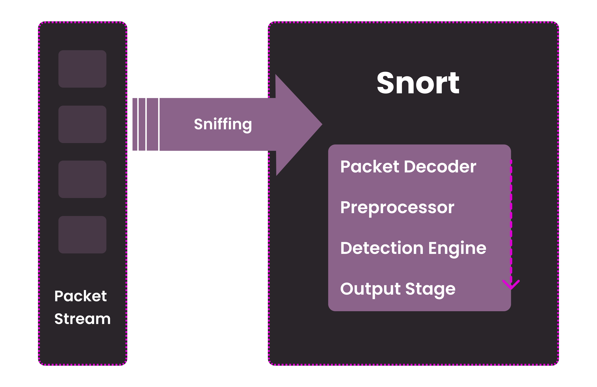
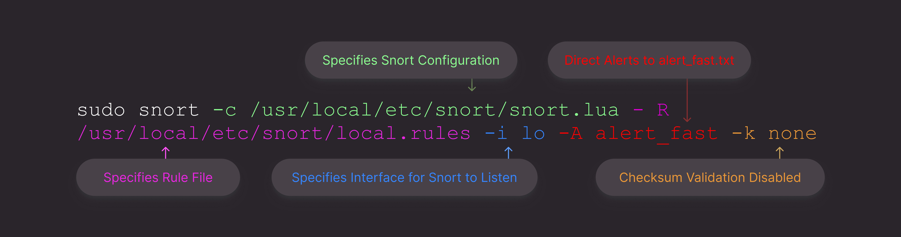
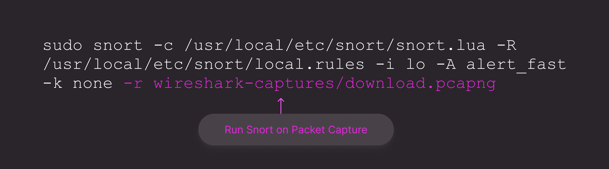
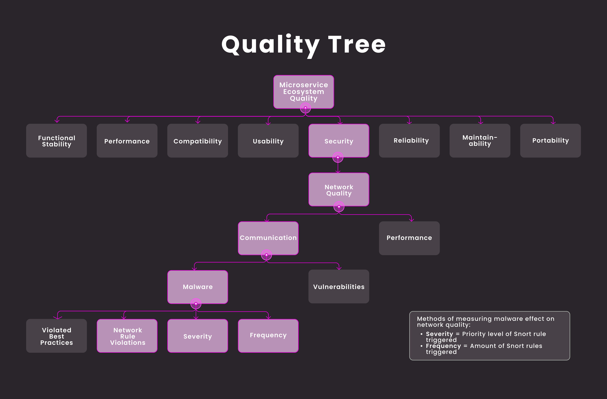

# Snort Intrusion Detection for Network Traffic Analysis Between Docker Containers 

* In this research project we explore the integration of Snort, an open-source network intrusion detection and prevention system, with Wireshark to analyze network quality, particularly within cloud microservice ecosystems. Through a detailed examination of Snort's architecture, configuration setup, and test cases, a testing environment is established, alongside enhanced proficiency in Snort's custom detection rules. By leveraging metrics such as severity and frequency of Snort alerts, the exploration of network traffic analysis within Docker environments is ongoing, aiming to quantify the impact of malware on network integrity and thereby contributing to the advancement of cybersecurity practices in today's dynamic digital landscape.

## Contributors
* Megan Steinmasel
* Brian Schumitz

## Introduction to Snort 

* We are employing Snort 3 for real-time threat detection in our research project.
* Consult the official [Snort 3 documentation](https://docs.snort.org/start/) for configuration and rule-writing guidance.
* If you wish to bypass the 'Introduction to Snort' and proceed to our 'Problem Statement,' click [here](https://github.com/megansteinmasel/snort-network-quality/blob/main/README.md#problem-statement).

### Overview

* Snort is an open-source network intrusion detection and prevention system that monitors network traffic in real-time, analyzing packets against rule files and generating alerts.
* Detection can be done through community rulesets and custom rules.
* Rules define the criteria for detecting specific network traffic patterns associated with known threats or suspicious activity.
* Snort also provides detailed logging and output capabilities for effective threat investigation. 

### Snort Intrusion Detection Process

* An intrusion detection system is a security tool that monitors traffic on a network for malicious activity. Intrusion detection system functions include analyzing system vulnerabilities, user activities, recognizing patterns typical of known cybersecurity threats, and many others.
* At the core of Snort's intrusion detection system, the packet decoder efficiently gathers packets from various interfaces, forwards them for preprocessing or direct analysis by the detection engine, and ultimately generates alerts and logs based on intrusion detection findings. All of these components collaborate to identify specific threats and subsequently implement the necessary actions tailored to each particular threat.

 

* Packet Decoder
  * This process gathers packets from various network interfaces. It then forwards these packets either to a preprocessor or directly to the detection engine for further analysis.
* Preprocessor
  * The preprocessor manipulates or organizes packets before they reach the detection engine. Its primary function is to perform operations on packets, such as repairing corrupted packets or generating alerts if anomalies are detected. It plays a crucial role in ensuring the integrity of packet content by rearranging strings and detecting patterns within them. Additionally, the preprocessor handles defragmentation, a vital task to reassemble fragmented packets.
* Detection Engine
  * The detection engine is responsible for identifying intrusion activities within packets by utilizing Snort rules. Upon detecting such activity, it applies the corresponding rule, while dropping the packet if no intrusion is detected. The response time of the detection engine varies depending on factors such as the processing power of the machine and the number of rules defined in the system.
* Output Stage
  * This comprehensive system is responsible for generating alerts and logging packets. It operates based on the findings of the detection engine. Depending on the content of a packet, it may either log the activity or trigger an alert. All log files are stored in a preconfigured location, which can be customized using command line options. The system offers various command line options to modify the type and detail of logged information.
 
### Snort Rules

* Snort rules contain two parts, the rule header and the rule options. The rule header contains information that specifies the conditions under which action the rule takes. Rule options provide further refined criteria for matching traffic against the rule header. These options are used to specify the characteristics of the traffic being monitored and the conditions for triggering an alert. Common options include:
  * File Inspection: Inspect file data within network traffic for malicious indicators.
  * Content-Matching: Allows matching based on the content of the packet payload.
  * Byte-Testing: Tests specific byte sequences within packets.
* Combining the rule header with the rule options produces the following Snort rule structure:
  * [Action] [Protocol] [Source IP] [Source Port] -> [Destination IP] [Destination Port] ([Options])
    * Action: This specifies what action Snort should take when the rule matches. Common actions include "alert," which generates an alert, and "drop," which drops the packet.
      * Other options include "log," "pass," "reject," "sdrop," and "dynamic."
    * Protocol: This specifies the network protocol being used, such as TCP, UDP, ICMP, or IP.
    * Source IP: This specifies the source IP address from which the traffic originates.
    * Source Port: This specifies the source port number used by the sender.
    * Direction: Dictates which IP address and port number is the source and which is the destination.
    * Destination IP: This specifies the destination IP address to which the traffic is being sent.
    * Destination Port: This specifies the destination port number on the destination IP.
    * Options: This optional field can include additional parameters to refine the rule, such as payload content to match against, packet length, or specific flags.
* To get started writing custom Snort rules, we used [Snorpy](http://snorpy.cyb3rs3c.net/) to initiate the process.

### Snort Community Rulesets and Custom Rules

* Community rulesets are pre-defined rulesets created and maintained by the Snort community. These rulesets are developed by security professionals and researchers to detect various types of network threats and attacks. Community rulesets are often updated frequently to address emerging vulnerabilities.
  * To download the Snort 3 community ruleset (snort3-community-rules.tar.gz), [press here](https://www.snort.org/downloads).
* Custom rules allow users to define their detection criteria tailored to their specific network environment and security requirements. This process encompasses creating a ruleset file and including it in Section 5 of the Snort configuration file. Below are a few examples of custom Snort rules.
  * `alert icmp any any -> any any (msg:"ICMP Ping Detected"; sid:1;)`
    * This Snort rule detects ICMP pings from any source IP and port, to any destination IP and port.
  * `alert tcp any any -> any 80 (msg:"HTTP GET Request Detected"; content:"GET"; http_method; sid:2;)`
    * This Snort rule will generate an alert for any HTTP GET request sent over TCP port 80.

### Snort Configuration

* We will be focusing on Sections 5 (Configure Detection) and Section 7 (Configure Outputs) of the configuration file. Section 5 is dedicated to configuring Snort's detection abilities. These options include enabling decoder and inspector alerts, including custom rulesets and default variables, configuring additional rule actions like react or reject, and enabling the payload injection utility. Section 7 is dedicated to configure various outputs from the detection engine. These options include event logging, packet logging, and additional log options like packet capture and file log. 
* Only Sections 5 (Configure Detection) and Section 7 (Configure Outputs) of the Snort configuration were modified to tailor the system to our project's requirements and goals. Below are the changes we made to the initial Snort configuration.
  * Section 5: Configure Detection
    * Include a custom ruleset file that Snort will utilize during the detection process.
      * ` ips = {variables = default_variables, include = 'local.rules'} `
  * Section 7: Configure Outputs
    * Uncomment the alert_fast line to enable the output log and specify file options.
      * ` alert_fast = {file = true} `

## Problem Statement

* Ensuring the quality and security of software systems is crucial in our ever-expanding digital world. To that end, the Software Engineering and Cybersecurity Lab (SECL) at Montana State University developed PIQUE: a Platform for Investigative software Quality Understanding and Evaluation. PIQUE is a language-agnostic system that can be adjusted for language-specific static-analysis operations. One PIQUE model focuses on measuring the quality of cloud microservice ecosystems. Cloud ecosystems use tools like Docker, an open-source development tool, to deploy, run, update, and manage containerized services to create efficient and scalable web applications. Our research is focused on measuring the quality of networking services, which are critical in cloud infrastructure. Computer networks are constant targets of cyber-attacks, and many incident response tools exist to defend against malicious network traffic. One of these tools is called Snort. Snort is an open-source intrusion detection and prevention system that can detect and log benign and malicious network traffic using rules. Snort rules delineate patterns to look out for in network traffic. Then, when those patterns are detected, rules will tell Snort how to react. Snort rules are powerful and have extensive customizability. By taking advantage of Snort’s flexible and powerful rule options, we can construct testing methods to measure and quantify the network quality of cloud ecosystems. Our research goal is to automate the process of running network quality tests between containerized services that use Docker.

## Project Goals

* Create a stable testing environment for generating and testing Snort rules.
* Gain proficiency in writing Snort rules.
* Understand network traffic patterns between Docker containers.

## Steps

1. Install a free Linux distribution. We used Ubuntu 22.04.3 LTS.
2. Install the most recent versions of Snort, Docker, and Wireshark.
3. Configure Snort, Docker, and Wireshark.
4. Validate consistency of tools:
   * Test the consistency of Snort.
   * Test communication between Docker containers.
5. Introduce malware:
   * Containerize malware with Docker.
   * Analyze communication patterns and specific packets triggering Snort alerts in Wireshark.
7. Develop a scheme for measuring the effect of Snort alerts on network quality (severity & frequency).

## Environment 

* Operating System: Ubuntu Linux Version 22.04.3 LTS
* Wireshark Version 4.2.2-1 ubuntu22.04.0 ppa2
  * Details
    * Priority: Optional
    * Section: Net
    * Maintainer: Balint Reczey
    * Installed-Size: 10.2 MB
    * Download-Size: 4,673 KB
    * APT-Manual_Installed: Yes
* Docker Version 25.0.3, Build 4debf41
  * Installation
    * [Instructions](https://docs.docker.com/desktop/install/ubuntu/)
      * Installed Docker’s apt Repository
      * Download DEB Package
      * Install Package w/ apt
  * Details
    * Server: Docker Desktop 4.27.2
      * Version: 25.0.3
      * API Version: 1.44
      * Go Version: go1.21.6
    * Client: Docker Engine - Community
      * Cloud Integration: v1.0.35+desktop.10
      * Version: 25.0.3
      * API Version: 1.44
      * Go Version: go1.21.6
      * OS/Arch: linux/amd64
      * Context: desktop-linux
* Snort Version 3.1.78.0
  * Installation
    * [Instructions](https://www.zenarmor.com/docs/linux-tutorials/how-to-install-and-configure-snort-on-ubuntu-linux#how-to-install-snort-3-on-ubuntu-2204)
  * Details
    * DAQ Version: 3.0.14
    * LuaJIT Version: 2.1.0-beta3
    * OpenSSL Version: 3.0.2 15 Mar 2022
    * Libpcap Version: 1.10.1
    * PCRE Version: 8.39 2016-06-14
    * ZLIB Version: 1.2.11
    * LZMA Version: 5.2.5

## Test Case One - Test for Consistency

### Description
  * Test Case One ensures the consistent and proper functioning of Snort. Test Case One will verify if Snort can detect a TCP connection through Netcat by sending a benign file with a specific port number and matching the content of the file data.

### Steps
  1. Find a Port Number
      * `netstat -an | grep 4444`
      * `netstat -an | grep LISTEN | grep 4444`
  2. Put Networks in Promiscuous Mode
      * `sudo ip link set dev enp0s31f6 promisc on`
      * `sudo ip link set dev lo promisc on`
  3. Create Snort Rules
      * Create a rule file and add the rules in local.rules
  4. Start Snort
      * Terminal window 1:
        * `sudo snort -c /usr/local/etc/snort/snort.lua -R /usr/local/etc/snort/local.rules -i lo -A alert_fast -k none`
          * “-A alert_fast” tells Snort to direct the alerts to alert_fast.txt
          * “-c /usr/local/etc/snort/snort.lua” specifies the Snort configuration
          * “-i lo” specifies the interface that Snort should listen on for traffic
          * “-R /usr/local/etc/snort/local.rules” specifies the rule file
          * “-k none” disables checksum validation of packets
  5. Send Benign File Using Netcat
      * Terminal window 2:
        * `nc -l 4444`
      * Terminal window 3:
        * `nc 127.0.0.1 4444 < file_to_send.txt`
          * “nc 127.0.0.1 4444” establishes a connection to the local machine (127.0.0.1) on port 4444
          * “< file_to_send.txt” uses input redirection (<) to read data from the file named file_to_send.txt and sends through the established connection
  6. Stop Snort and check the alert_fast.txt output log

### Running Snort
* In Test Case One, we ran Snort in the following manner.
  
  
  
* Running Snort in this manner is typically done for real-time network traffic analysis and intrusion detection. It's used to actively monitor network traffic as it flows through the specified network interface.

### Rule Descriptions
  * Benign File Detected Using Content Matching (v1):
    * Description: This rule is triggered when Snort detects a TCP packet with the specified content.
    * Action: It generates an alert message stating that a benign file has been detected.
    * Content Matching: The rule looks for the string "This is a benign file. There is nothing interesting here." within the TCP packet.
    * SID: 1
  * Activity on Port 4444 (v1):
     * Description: This rule detects any activity on TCP port 4444, regardless of the source and destination.
     * Action: It generates an alert message indicating activity on port 4444.
     * SID: 3
  * Activity on Port 4444 (v2):
     * Description: This rule specifically detects TCP traffic going from any source to port 4444 on the local machine (127.0.0.1).
     * Action: It generates an alert message indicating activity on port 4444 with this specific source-destination pattern.
     * SID: 4
  * Activity on Port 4444 (v3):
     * Description: This rule detects TCP traffic going from port 4444 on the local machine (127.0.0.1) to any destination.
     * Action: It generates an alert message indicating activity on port 4444 with this specific source-destination pattern.
     * SID: 5
  * Activity on Port 4444 (v4):
     * Description: This rule detects TCP traffic going from any source to port 4444 on any destination.
     * Action: It generates an alert message indicating activity on port 4444 with this specific source-destination pattern.
     * SID: 6

### Data Analysis and Results
* We repeated the Test Case One process several times to determine if Snort alerts were consistently triggered.
* Variables we examined include runtime, alerts, logged alerts, total alerts, port activity alerts, and content matching alerts.
  * Alerts, logged alerts, total alerts, port activity alerts, and content-matching alerts remained constant across all runs of the experiment.
  * The consistent port activity and content-matching alerts indicate a reliable testing environment.
* While Snort was alerting consistently, the runtime somewhat varied across executions in Test Case One.
  * The mean runtime of Snort was 93.868 seconds in Test Case One.
  * Found that running Snort on Wireshark captures created a consistent and fast runtime.
* Found that the Snort rule in local.rules with SID: 2 would only trigger while running Snort on Wireshark captures.

## Test Case Two - Explore SHA-256 Hash-Matching

### Description
* Test Case Two was created to test Snort’s SHA-256 hash-matching and signature-based detection capabilities. This test case is also modeled after a previous experiment with Snort which can be found [here](https://github.com/megansteinmasel/snort-malware-detection).

### Steps
1. Create a Python Web Server
    * [Instructions](https://www.geeksforgeeks.org/network-programming-python-http-server/)
    * Create an index.html file that contains a download button for the benign file 
2. Put Networks in Promiscuous Mode
    * `sudo ip link set dev enp0s31f6 promisc on`
    * `sudo ip link set dev lo promisc on`
3. Start Packet Capture on Wireshark
4. Spin Up Web Server
    * Go to localhost: 8080
    * Press the download button to download the benign file
5. Stop Packet Capture
6. Run Snort on Packet Capture
   * `sudo snort -c /usr/local/etc/snort/snort.lua -R /usr/local/etc/snort/local.rules -i lo -A alert_fast -k none -r wireshark-captures/download.pcapng`
     * This flag specifies that Snort should read network traffic data from a pcap file located at wireshark-captures/download.pcapng

### Running Snort
* In Test Case Two, we ran Snort in the following manner.
  
  
 
* Running Snort with Wireshark captures involves analyzing pre-recorded network traffic stored in pcap files (Wireshark capture files). It's used to analyze historical network data or traffic captured from various sources, rather than monitoring live traffic.

### Results
* The port activity and content-matching rules from Test Case One still triggered when running Test Case Two.
* Unfortunately, the SHA-256 hash matching rules did not trigger.
* Decided to reach out to the Snort community via Discord for help.

### Reaching Out to Development Team
* Reached out via the Snort Discord channel for information regarding hash-matching in the context of the project.
* Here’s what we learned:
  * Using hash options (MD5, SHA-256, SHA-512) for real-time payload detection is inefficient.
  * Without adding extra clarification for content-matching beforehand, every single packet’s hash value will have to be calculated.
    * Note - This could be the reason for varying runtime in Test Case One since some signature-based detection rules were in our rule file at the time.
  * Often won’t work for larger files as files must be reassembled from memory. 

## In Progress & Future Work

### Docker 

* We are currently concentrating on analyzing network traffic between Docker containers and assessing the effectiveness of Snort in detecting security threats between containerized environments.
* This process entails conducting a comprehensive literature review and identifying test scenarios for network traffic analysis.
* These steps will contribute to the development of our network quality model.

### Network Quality

* Although the quality of network security between Docker containers has not been measured before, we suspect that using Snort for network traffic analysis, measuring severity (priority level of Snort rule triggered) and frequency (amount of Snort rules triggered), can be beneficial. This measurement, focusing on severity and frequency, is currently being integrated into our expanding model. Additionally, the depiction of this process in our evolving quality tree model signifies ongoing development towards a comprehensive evaluation of network security effectiveness.

   

## Other Works

* Excited to have shared our latest research on Snort Intrusion Detection for Network Traffic Analysis Between Docker Containers at the Montana State University Research Celebration! Grateful for the opportunity to connect with fellow student researchers!
   

  

